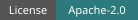

<h1 align="center"></h1>

<p align="center">
  <strong>Codex session metrics for your existing Prometheus and Grafana.</strong>
</p>

<p align="center">
  <a href="LICENSE"></a>
</p>

<p align="center">
  <a href="https://turbra.github.io/traceonaut/install/">Install</a> •
  <a href="https://turbra.github.io/traceonaut/getting-started/">Quick Start</a> •
  <a href="https://turbra.github.io/traceonaut/">Documentation</a>
</p>

---

Traceonaut reads existing Codex session files and exposes authenticated metrics
for Prometheus. Import its dashboard JSON into Grafana to see recorded token
usage, session activity, command outcomes, and collector health.

```text
Codex files -> collector on your workstation -> Prometheus -> Grafana
```

Prometheus pulls metrics; the collector does not push them. A separate renderer
adds readable names to the dashboard JSON, not metric samples. No Codex telemetry
changes, OpenTelemetry, node_exporter, or alerting services are required.

## Install

Clone on the workstation containing your Codex profile. The collector uses
Python's standard library; there are no Python packages to install.

```bash
git clone https://github.com/turbra/traceonaut.git
cd traceonaut
python3 scripts/collect_codex_sessions.py --help
```

See the [installation guide](https://turbra.github.io/traceonaut/install/) for
requirements. Use your existing Prometheus and Grafana, locally or on a separate
server.

## Quick Start

Follow the [Quick Start guide](https://turbra.github.io/traceonaut/getting-started/):

1. **[Run the collector](https://turbra.github.io/traceonaut/getting-started/#1-run-the-collector)** against
   your Codex profile, using a protected scrape credential.
2. **[Configure Prometheus](https://turbra.github.io/traceonaut/getting-started/#2-add-the-prometheus-scrape-job)**
   to scrape the workstation's `/metrics` endpoint.
3. **[Import a dashboard](https://turbra.github.io/traceonaut/getting-started/#3-import-a-dashboard-into-grafana)**
   into Grafana and select your Prometheus datasource.

For remote Prometheus, choose a reachable LAN/VPN address with `--host` and allow
that server through the workstation firewall. Loopback is the default. Bearer
authentication does not encrypt HTTP; follow the [network requirements](https://turbra.github.io/traceonaut/operations/#network-and-credentials).

No release build, Grafana file provisioning, or extra monitoring service is needed.

## Documentation

Browse the [documentation](https://turbra.github.io/traceonaut/) for all guides.

| Guide | What it covers |
| --- | --- |
| [Dashboards](https://turbra.github.io/traceonaut/#dashboards) | Beta, Unified, All sessions, and optional CWO observed dispatches. |
| [Data and Limits](https://turbra.github.io/traceonaut/data-and-limits/) | Sources, retention, token accounting, and missing data. |
| [Operations](https://turbra.github.io/traceonaut/operations/) | Services, automatic name updates, upgrades, and troubleshooting. |
| [CWO integration](https://turbra.github.io/traceonaut/integrations/cwo/) | Optional job metrics from [Complex Work Orchestration](https://github.com/gprocunier/complex-work-orchestration), a Codex skill for coordinating agents and tracking work across sessions. |

CWO is not required for ordinary Codex session collection.

## License

[Apache License 2.0](LICENSE).
