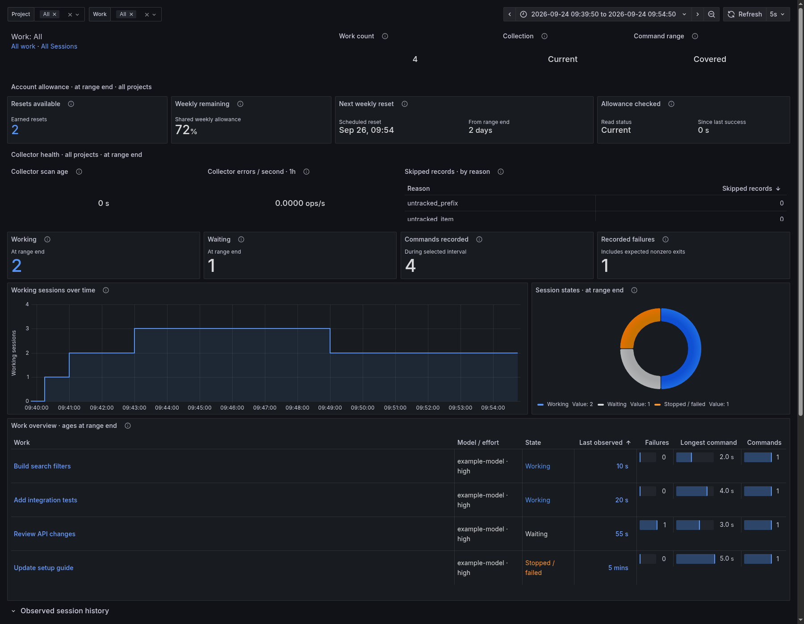

<h1 align="center"><a href="https://turbra.github.io/traceonaut/"></a></h1>

<p align="center">
  <strong>Codex session metrics for your existing Prometheus and Grafana.</strong>
</p>

<p align="center">
  <a href="https://www.apache.org/licenses/LICENSE-2.0"></a>
</p>

<p align="center">
  <a href="https://turbra.github.io/traceonaut/install/">Install</a> •
  <a href="https://turbra.github.io/traceonaut/getting-started/">Quick Start</a> •
  <a href="https://turbra.github.io/traceonaut/">Documentation</a>
</p>


---

Traceonaut shows Codex session activity, recorded token usage, command outcomes,
and collector health in Grafana. It reads your existing Codex files and serves
metrics for your Prometheus to scrape.



*Work Overview. All screenshots use synthetic example data.*

```text
Codex files → Traceonaut collector → Prometheus → Grafana
```

## Install

Clone on the workstation holding your Codex profile. The collector uses Python's
standard library. See [Install](https://turbra.github.io/traceonaut/install/) for
supported and tested versions.

```bash
git clone https://github.com/turbra/traceonaut.git
cd traceonaut
python3 scripts/collect_codex_sessions.py --help
```

## Quick Start

These commands use Prometheus on the same machine. For remote or container
Prometheus, use the [Quick Start network tabs](https://turbra.github.io/traceonaut/getting-started/#1-run-the-collector).

### 1. Run the Collector

From the checkout root, choose your Codex profile and create a private data directory:

<!-- setup-paths -->
```bash
export TRACEONAUT_SOURCE_HOME="$HOME/.codex"
export TRACEONAUT_DATA_DIR="$HOME/.local/share/traceonaut"
export TRACEONAUT_METRICS_CREDENTIAL="$TRACEONAUT_DATA_DIR/metrics.token"
export TRACEONAUT_LISTEN_ADDRESS="127.0.0.1"
install -d -m 700 "$TRACEONAUT_DATA_DIR"
```

Create the token once; reuse it on restart:

<!-- credential-create -->
```bash
python3 scripts/create_metrics_token.py --credential-file "$TRACEONAUT_METRICS_CREDENTIAL"
```

<!-- run-collector -->
```bash
python3 scripts/collect_codex_sessions.py \
  --codex-home "$TRACEONAUT_SOURCE_HOME" \
  --session-state-dir "$TRACEONAUT_DATA_DIR/session-state" \
  --snapshot-file "$TRACEONAUT_DATA_DIR/sessions.json" \
  --credential-file "$TRACEONAUT_METRICS_CREDENTIAL" \
  --host "$TRACEONAUT_LISTEN_ADDRESS" --port 9464
```

Leave this terminal running. The full [Quick Start](https://turbra.github.io/traceonaut/getting-started/)
also includes a one-pass source check.

### 2. Add the Prometheus Scrape Job

Merge this job into your Prometheus configuration. Set `credentials_file` to the
absolute token path readable by Prometheus, then validate and reload its configuration:

<!-- prometheus-scrape -->
```yaml
scrape_configs:
  - job_name: traceonaut
    scrape_interval: 5s
    scrape_timeout: 4s
    authorization:
      type: Bearer
      credentials_file: /absolute/path/to/traceonaut/metrics.token
    static_configs:
      - targets: ['127.0.0.1:9464']
```

### 3. Import a Dashboard into Grafana

In a second terminal, from the checkout root:

<!-- render-beta -->
```bash
export TRACEONAUT_DATA_DIR="$HOME/.local/share/traceonaut"
python3 scripts/render_codex_beta_dashboard.py \
  --template examples/observability/codex-work-overview-beta.json \
  --snapshot-file "$TRACEONAUT_DATA_DIR/sessions.json" \
  --output "$TRACEONAUT_DATA_DIR/work-overview.json"
```

In Grafana, open **Dashboards → New → Import**, upload `work-overview.json`, and select
your Prometheus datasource. The dashboard opens as **Work Overview**.

## Dashboards at a Glance

| Dashboard | Use it for |
| --- | --- |
| [Work Overview](https://turbra.github.io/traceonaut/dashboards/work-overview/) | Session activity, command outcomes, token totals and collector health. Start here. |
| [Unified](https://turbra.github.io/traceonaut/dashboards/unified/) | Sessions, agent relationships and recorded usage in one view. |
| [All Sessions](https://turbra.github.io/traceonaut/dashboards/all-sessions/) | A compact session inventory and usage summary. |
| [CWO Dispatches](https://turbra.github.io/traceonaut/dashboards/cwo/) | Optional orchestration jobs, resources and outcomes from [CWO](https://github.com/gprocunier/complex-work-orchestration), a Codex skill for coordinating agents. |

## Documentation

| Guide | Covers |
| --- | --- |
| [Reading the Values](https://turbra.github.io/traceonaut/dashboards/reading-values/) | Counts, session states, time ranges and missing data. |
| [Operations](https://turbra.github.io/traceonaut/operations/) | Services, upgrades, name updates, networking and troubleshooting. |
| [Scripts](https://turbra.github.io/traceonaut/reference/scripts/) | Arguments and defaults. |
| [Metrics](https://turbra.github.io/traceonaut/reference/metrics/) | Names, types, labels and meanings. |
| [Example Queries](https://turbra.github.io/traceonaut/reference/example-queries/) | PromQL for usage and collector health. |
| [Data Sources and Privacy](https://turbra.github.io/traceonaut/reference/data-sources-and-privacy/) | Files read, data stored and endpoint contents. |
| [Retention and Limits](https://turbra.github.io/traceonaut/reference/retention-and-limits/) | Export windows and historical views. |
