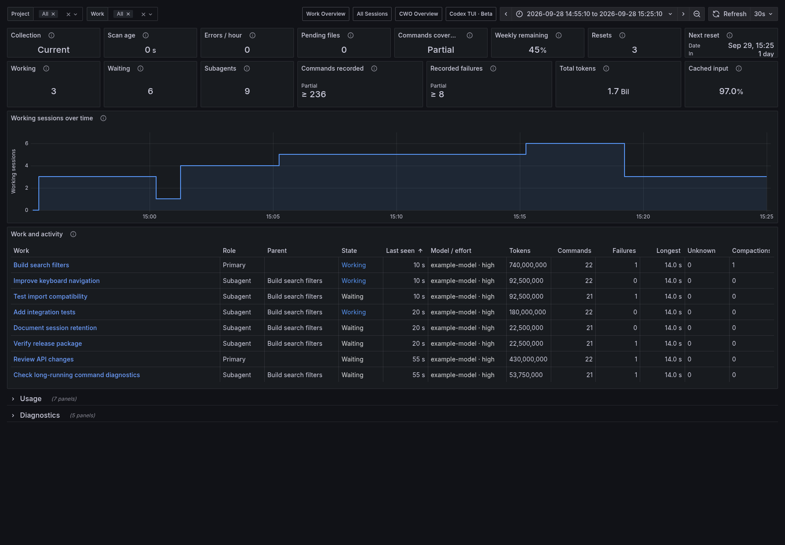

<h1 align="center"><a href="https://turbra.github.io/traceonaut/"></a></h1>

<p align="center">
  <strong>Codex and IBM Bob session metrics for your existing Prometheus and Grafana.</strong>
</p>

<p align="center">
  <a href="https://www.apache.org/licenses/LICENSE-2.0"></a>
</p>

<p align="center">
  <a href="https://turbra.github.io/traceonaut/install/">Install</a> •
  <a href="https://turbra.github.io/traceonaut/getting-started/">Quick Start</a> •
  <a href="https://turbra.github.io/traceonaut/">Documentation</a>
</p>


---

Traceonaut shows session activity, recorded token usage and collector health in
Grafana. It reads local Codex files or IBM Bob's database and serves metrics for
Prometheus to scrape. Use Codex, Bob, or both.



*Work Overview. All screenshots use synthetic example data.*

```text
Codex files / Bob database → Traceonaut collector → Prometheus → Grafana
```

## Install

Clone on the workstation holding your Codex or Bob profile. The collector uses Python's
standard library. See [Install](https://turbra.github.io/traceonaut/install/) for
supported and tested versions.

```bash
git clone https://github.com/turbra/traceonaut.git
cd traceonaut
python3 scripts/collect_sessions.py --help
```

## Quick Start

Choose Codex, IBM Bob or both. These commands use Prometheus on the same machine.
For remote and container setups, use the [Quick Start network tabs](https://turbra.github.io/traceonaut/getting-started/#1-run-the-collector).

### 1. Run the Collector

Set your profile paths and create private collector storage:

<!-- setup-paths -->
```bash
export TRACEONAUT_SOURCE_HOME="$HOME/.codex"
export TRACEONAUT_CODEX_HOME="$TRACEONAUT_SOURCE_HOME"
export TRACEONAUT_BOB_HOME="$HOME/.bob"
export TRACEONAUT_DATA_DIR="$HOME/.local/share/traceonaut"
export TRACEONAUT_METRICS_CREDENTIAL="$TRACEONAUT_DATA_DIR/metrics.token"
export TRACEONAUT_LISTEN_ADDRESS="127.0.0.1"
install -d -m 700 "$TRACEONAUT_DATA_DIR"
```

Create the endpoint token once; reuse it on restart:

<!-- credential-create -->
```bash
python3 scripts/create_metrics_token.py --credential-file "$TRACEONAUT_METRICS_CREDENTIAL"
```

Choose one source configuration:

#### Codex

<!-- run-collector -->
```bash
python3 scripts/collect_sessions.py \
  --codex-home "$TRACEONAUT_SOURCE_HOME" \
  --session-state-dir "$TRACEONAUT_DATA_DIR/session-state" \
  --snapshot-file "$TRACEONAUT_DATA_DIR/sessions.json" \
  --credential-file "$TRACEONAUT_METRICS_CREDENTIAL" \
  --host "$TRACEONAUT_LISTEN_ADDRESS" --port 9464
```
#### IBM Bob

<!-- bob-only-serve -->
```bash
python3 scripts/collect_sessions.py \
  --bob-home "$TRACEONAUT_BOB_HOME" \
  --session-state-dir "$TRACEONAUT_DATA_DIR/session-state" \
  --bob-snapshot-file "$TRACEONAUT_DATA_DIR/bob.json" \
  --credential-file "$TRACEONAUT_METRICS_CREDENTIAL" \
  --host "$TRACEONAUT_LISTEN_ADDRESS" --port 9464
```
#### Both

<!-- both-sources-serve -->
```bash
python3 scripts/collect_sessions.py \
  --codex-home "$TRACEONAUT_CODEX_HOME" \
  --bob-home "$TRACEONAUT_BOB_HOME" \
  --session-state-dir "$TRACEONAUT_DATA_DIR/session-state" \
  --snapshot-file "$TRACEONAUT_DATA_DIR/sessions.json" \
  --bob-snapshot-file "$TRACEONAUT_DATA_DIR/bob.json" \
  --credential-file "$TRACEONAUT_METRICS_CREDENTIAL" \
  --host "$TRACEONAUT_LISTEN_ADDRESS" --port 9464
```

Leave the collector running; **Ctrl+C** stops it. Use a second terminal for rendering.
For persistent collection, use [Run as a Service](https://turbra.github.io/traceonaut/operations/run-as-a-service/).

### 2. Add the Prometheus Scrape Job

Give Prometheus a protected copy of the endpoint token, readable by its service
user. Set `credentials_file` to its absolute path as seen by Prometheus.
Add this job to your existing configuration:

<!-- prometheus-scrape -->
```yaml
scrape_configs:
  - job_name: traceonaut
    scrape_interval: 5s
    scrape_timeout: 4s
    authorization:
      type: Bearer
      credentials_file: /absolute/path/to/traceonaut/metrics.token
    static_configs:
      - targets: ['127.0.0.1:9464']
```

Validate and reload Prometheus:

```bash
promtool check config /path/to/prometheus.yml
```

Check `up{job="traceonaut"}` in Prometheus; expect `1`.

### 3. Import a Dashboard into Grafana

Run the renderer for each source you selected, from the checkout root in a second terminal.

**Codex**

<!-- render-beta -->
```bash
export TRACEONAUT_DATA_DIR="$HOME/.local/share/traceonaut"
python3 scripts/render_codex_beta_dashboard.py \
  --template examples/observability/codex-work-overview-beta.json \
  --snapshot-file "$TRACEONAUT_DATA_DIR/sessions.json" \
  --output "$TRACEONAUT_DATA_DIR/work-overview.json"
```

**IBM Bob**

<!-- render-bob -->
```bash
export TRACEONAUT_DATA_DIR="$HOME/.local/share/traceonaut"
python3 scripts/render_bob_dashboard.py \
  --template examples/observability/ibm-bob-beta.json \
  --snapshot-file "$TRACEONAUT_DATA_DIR/bob.json" \
  --output "$TRACEONAUT_DATA_DIR/ibm-bob-beta.json"
```

In Grafana, open **Dashboards → New → Import**, upload the rendered file, and
select your Prometheus datasource. Use `work-overview.json` for Codex and
`ibm-bob-beta.json` for IBM Bob. When collecting both, import both dashboards.

See [Automatic Name Updates](https://turbra.github.io/traceonaut/operations/automatic-name-updates/) to refresh Project and Chat names as you work.

## Sources

- [Codex](https://turbra.github.io/traceonaut/sources/codex/): saved sessions, tokens and commands; optional account allowance and CWO activity.
- [IBM Bob](https://turbra.github.io/traceonaut/sources/ibm-bob/): saved chats, responses and tool results; optional token capture.

## Dashboards at a Glance

### Codex

| Dashboard | Use it for |
| --- | --- |
| [Work Overview](https://turbra.github.io/traceonaut/dashboards/work-overview/) | Session activity, command outcomes, token totals and collector health. |
| [All Sessions](https://turbra.github.io/traceonaut/dashboards/all-sessions/) | A compact session inventory and usage summary. |
| [Codex TUI · Beta](https://turbra.github.io/traceonaut/dashboards/tui-beta/) | The Codex CLI Usage screen in Grafana. |
| [CWO Overview](https://turbra.github.io/traceonaut/dashboards/cwo/) | CWO sessions, agents, usage and workflow activity. |

### IBM Bob

| Dashboard | Use it for |
| --- | --- |
| [IBM Bob · Beta](https://turbra.github.io/traceonaut/dashboards/ibm-bob-beta/) | Chats, saved and captured tokens, responses and tool results. |

## Documentation

| Guide | Covers |
| --- | --- |
| [Choosing a Dashboard](https://turbra.github.io/traceonaut/dashboards/) | Views grouped by source. |
| [Operations](https://turbra.github.io/traceonaut/operations/) | Services, upgrades, names, networking and troubleshooting. |
| [Scripts](https://turbra.github.io/traceonaut/reference/scripts/) | Arguments and defaults. |
| [Metrics](https://turbra.github.io/traceonaut/reference/metrics/) | Names, types, labels and meanings. |
| [Data Sources and Privacy](https://turbra.github.io/traceonaut/reference/data-sources-and-privacy/) | Files read, data stored and endpoint contents. |
| [Retention and Limits](https://turbra.github.io/traceonaut/reference/retention-and-limits/) | Visible history and accounting limits. |
