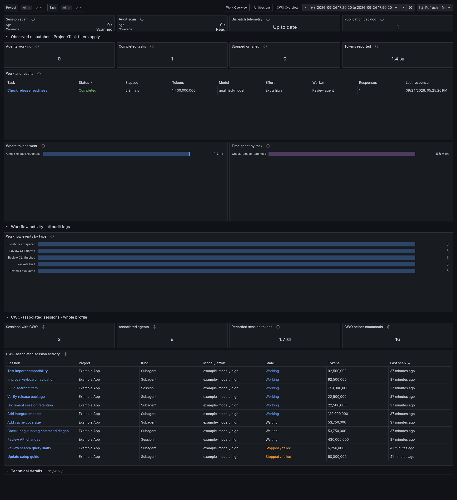

# CWO Overview



*Synthetic data in the current dashboard layout. Counts depend on enabled sources and the selected time range.*

This dashboard has three independent sections: **CWO-associated sessions** from Codex records, **Workflow activity** from selected CWO audit logs, and **Observed dispatches** from a job ledger. Enable the sources you use through [CWO Integration](../integrations/cwo.md).

## Import

Import [cwo-overview.json](../../examples/observability/cwo-overview.json) and select your Prometheus datasource.

For readable session names, use the existing private session snapshot:

```bash
TRACEONAUT_DATA_DIR="$HOME/.local/share/traceonaut"
CWO_DASHBOARD_DIR="$HOME/.local/share/traceonaut/dashboards"
install -d -m 700 "$CWO_DASHBOARD_DIR"
python3 scripts/render_observability_dashboard.py \
  --template examples/observability/cwo-overview.json \
  --session-snapshot-file "$TRACEONAUT_DATA_DIR/sessions-snapshot.json" \
  --output "$CWO_DASHBOARD_DIR/cwo-overview.json"
```

For observed-job names, also pass `--presentation-file /absolute/path/to/private/presentation.json` from the controller or observed-job runner. Either input can be used alone.

Import the generated file. Names remain presentation metadata; missing names have explicit fallbacks. See [Automatic Name Updates](../operations/automatic-name-updates.md) for watcher/provisioning use.

## Use the Dashboard

### CWO-Associated Sessions

Choose **Today** or **Last 7 days** to see associated sessions and agents with recorded activity in that interval. Values use the latest exported samples at the selected end time. The table includes project, session, kind, latest model/effort, state and recorded tokens. This section covers the selected Codex profile across projects; the Project and Task selectors apply only to observed dispatches.

Association comes from a structured CWO skill block, a supported helper command, or an associated parent before the child was created. **Recorded session tokens** includes whole-session history and can be a lower bound when usage is missing. It measures session usage, not CWO-exclusive cost. **CWO helper commands** counts source-time command completions, including failed attempts.

**CWO session source scan** reports whether the selected files have been scanned. Pending files and source gaps make counts provisional. Sessions follow the existing [30-day inactivity window and export cap](../reference/retention-and-limits.md#session-export).

### Workflow Activity

Packets built, dispatches prepared and reviews evaluated count recorded events whose **original timestamps** fall within the selected time range. This section covers all configured audit logs; the Project and Task selectors apply only to observed dispatches.

**Selected audit files**, **Audit scan age**, **Audit source errors** and **Skipped audit records** show health for the configured audit files only. Successful reads with no matching events show zero. Missing collection shows Unavailable; partial collection can show positive counts as lower bounds. The event-type chart lists only types present in the range.

The collector exports the newest 2,000 events from the last 30 days. Prometheus must scrape them before they can appear. See [Retention and Limits](../reference/retention-and-limits.md#cwo-workflow-audits).

### Observed Dispatches

These panels show jobs recorded by the observation hook or [Observed Job Runner](../integrations/observed-job-runner.md). Summary values use the last stored sample per dispatch within the selected range, which defaults to 30 days. They describe observed jobs retained in that range, rather than jobs started inside it.

If a short range is empty, widen it to include the last observed run. Completed jobs stop being exported after their final samples are confirmed in Prometheus. CWO-associated sessions can appear above while these job panels remain empty. Job metrics require the separate observed-job source.

Dispatches, agents and completed responses are separate counts. Requested/acknowledged settings describe configuration. Token totals carry availability/coverage states. Declared allowances and enforced limits are separate fields.

[Reading the Values](reading-values.md) explains common token and missing-value conventions.
