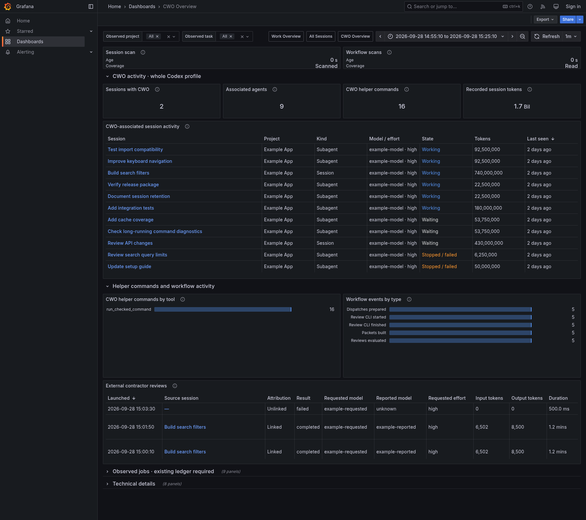

# CWO Overview



*Synthetic data in the current dashboard layout. Counts depend on enabled sources and the selected time range.*

CWO Overview shows Codex sessions and subagents that use CWO: their tokens, model/effort, completed turns, failed / aborted turns and turn time. Workflow audits and optional custom review-adapter results provide additional detail. Start with `--cwo-sessions` in [CWO Integration](../integrations/cwo.md#collect-cwo-sessions).

## Import

Import [cwo-overview.json](../../examples/observability/cwo-overview.json) and select your Prometheus datasource.

For readable session names, use the existing private session snapshot:

<!-- render-cwo -->
```bash
TRACEONAUT_DATA_DIR="$HOME/.local/share/traceonaut"
CWO_DASHBOARD_DIR="$HOME/.local/share/traceonaut/dashboards"
install -d -m 700 "$CWO_DASHBOARD_DIR"
python3 scripts/render_observability_dashboard.py \
  --template examples/observability/cwo-overview.json \
  --session-snapshot-file "$TRACEONAUT_DATA_DIR/sessions.json" \
  --output "$CWO_DASHBOARD_DIR/cwo-overview.json"
```

Import the generated file. Names remain presentation metadata; missing names have explicit fallbacks. See [Automatic Name Updates](../operations/automatic-name-updates.md) for watcher/provisioning use.

## Use the Dashboard

The main overview shows CWO-associated sessions, native agents, recorded session tokens and helper commands. Choose **Last 1 hour** to see sessions with activity and helper invocations in that hour. The session table appears directly below the headline values.

Use **Project** and **Session** to filter the headline counts, session table, helper commands and linked contractor reviews. Both allow multiple selections; **All** clears that filter. A Session selection matches those individual sessions or subagents. Project and Session selections apply together.

The rendered dropdowns use names from the exported session snapshot. Collection health and **Workflow events by type · all projects** remain profile-wide because their records have no project/session identity. Reviews with Unlinked, Pending or Ambiguous attribution appear when both dropdowns are **All**.

**Recorded session tokens** covers the selected sessions' whole recorded history, including work outside CWO. It is separate from tokens consumed during the selected range. Missing values display a dash; known empty counts display zero.

The top strip reports session collection, workflow-source health and review evidence gaps. **Partial** means the configured sources have incomplete coverage. Review gaps retain the known invocation row while unavailable usage stays blank. The default range is 30 days and refresh is one minute; choose a shorter range, such as **Last 1 hour**, to focus recent activity.

Configure [CWO session collection](../integrations/cwo.md#collect-cwo-sessions) and [workflow event collection](../integrations/cwo.md#collect-workflow-activity) in the CWO Integration guide. Optional review rows require the [custom review adapter](../integrations/custom-review-adapter.md).

### Sessions and Helper Commands

This section follows the selected projects and sessions. Association comes from a CWO skill block, a supported helper invocation, or an associated parent session.

| Column | Meaning |
| --- | --- |
| Session, Project, Kind | The session or subagent and its project. |
| Model / effort | Latest selected Codex settings. |
| State, Last seen | Latest recorded activity and its age at the selected range end. |
| Tokens | Recorded tokens for the whole session. |
| Completed turns, Failed / aborted turns | Recorded completed and failed or aborted turns across the session. A completed turn can be one step in a larger assignment. |
| Turn time | Sum of reported turn durations. Waiting between turns and other unreported time are excluded. |

The time picker selects sessions active in that range. Their token and turn totals cover recorded session history. A subagent session has its own measurements; a session reused for several assignments combines their measurements.

**CWO helper commands** and **CWO helper commands by tool** count supported invocations in completed Codex command records within the selected interval, including failed attempts. Compound commands retain an unknown helper outcome because the shell result also covers subsequent commands.

### Workflow Activity

**Workflow events by type** counts events whose original timestamps fall inside the selected range, across configured audit logs. It can be empty while session and helper activity is present: only operations that write audit events appear in that chart.

**External contractor reviews** shows requested and reported model, effort, tokens and duration for recorded invocations. **Execution** describes CLI completion or failure; **Evaluation** shows the audit verdict and any pending peer review. **Saved record** identifies unavailable evidence. Attempts remain visible when their launch dates fall within the selected range, including results recovered later. With [session attribution](../integrations/custom-review-adapter.md#link-reviews-to-codex-sessions) enabled, **Source session** links to the launcher. Unlinked, Pending and Ambiguous rows appear when both filters are **All**.

[Retention and Limits](../reference/retention-and-limits.md) explains source history and exports. [Reading the Values](reading-values.md) explains token totals, partial coverage and missing values.
