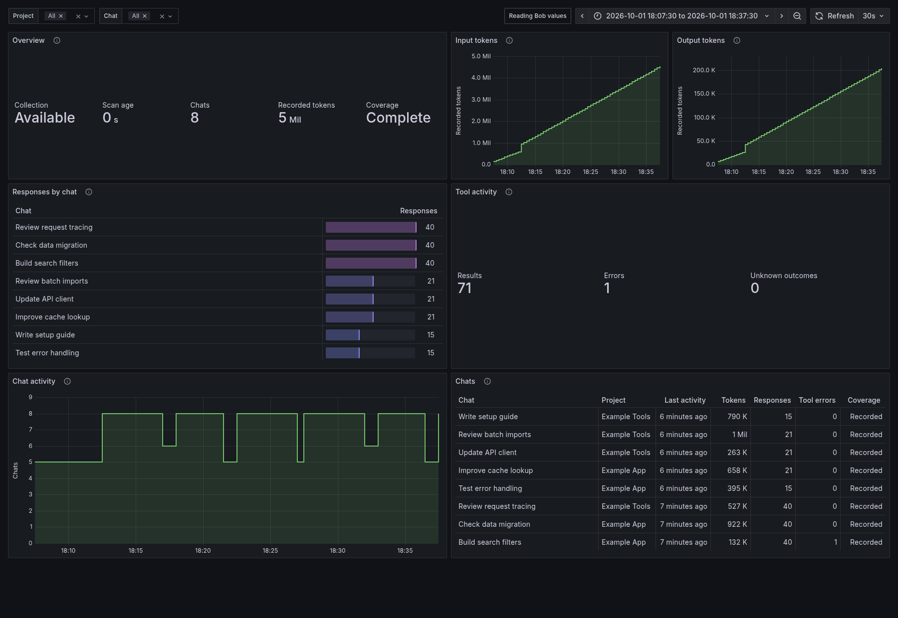

# IBM Bob · Beta



*Example data. No personal chats are shown.*

View Bob Shell chats, token usage and tool results in a compact, two-column
dashboard based on [Codex TUI · Beta](tui-beta.md). It displays only Bob data,
whether you collect Bob alone or alongside Codex.

## Import the Dashboard

Enable [IBM Bob Collection](../bob-collection.md), then run from the checkout root:

<!-- render-bob -->
```bash
export TRACEONAUT_DATA_DIR="$HOME/.local/share/traceonaut"
python3 scripts/render_bob_dashboard.py \
  --template examples/observability/ibm-bob-beta.json \
  --snapshot-file "$TRACEONAUT_DATA_DIR/bob.json" \
  --output "$TRACEONAUT_DATA_DIR/ibm-bob-beta.json"
```

In Grafana, open **Dashboards → New → Import**, upload `ibm-bob-beta.json`, and select
your Prometheus datasource. The title is **IBM Bob · Beta**.

## Use the Dashboard

Choose a **Project**, **Chat** and time range. Usage and activity panels share these
filters. Collection health covers the whole Bob source. The default range is 24
hours with a 30-second refresh.

| Section | Shows |
| --- | --- |
| Overview | Source availability, scan age, selected chats, recorded tokens and coverage. |
| Input tokens | Recorded input totals over Prometheus history. |
| Output tokens | Recorded output totals on a separate scale. |
| Responses by chat | The eight selected chats with the most saved assistant responses. |
| Tool activity | Saved tool results, explicit errors and unknown outcomes. |
| Chat activity | Chats with a saved message in the preceding five minutes. |
| Chats | Chat, project, last message, tokens, responses, tool errors and coverage. |

A chat is a Bob task: a conversation, subtask or subagent. Recent messages show
activity; they do not establish whether Bob is still running. Tool errors reflect
Bob's saved outcome, including errors from tools other than the shell.

## Read the Values

The selected range chooses chats by their last saved message. Chats with no saved
messages stay out of this view. Tokens and responses cover those chats' recorded
history, including earlier work. Token totals can fall
when chats expire from export or you change the selection. **K**, **Mil** and
**Bil** mean thousand, million and billion.

**Partial** means some records are missing, unsupported or have unknown values.
Available counts remain visible; missing values appear as **—**. If collection fails, tables retain the last
collected values and Overview shows unavailable or stale. Charts leave gaps.

The beta includes no model/effort, billing, plugins, skills or account-allowance
panels. Re-render and re-import to refresh chat names, or use
[Automatic Name Updates](../operations/automatic-name-updates.md) with the Bob renderer.
