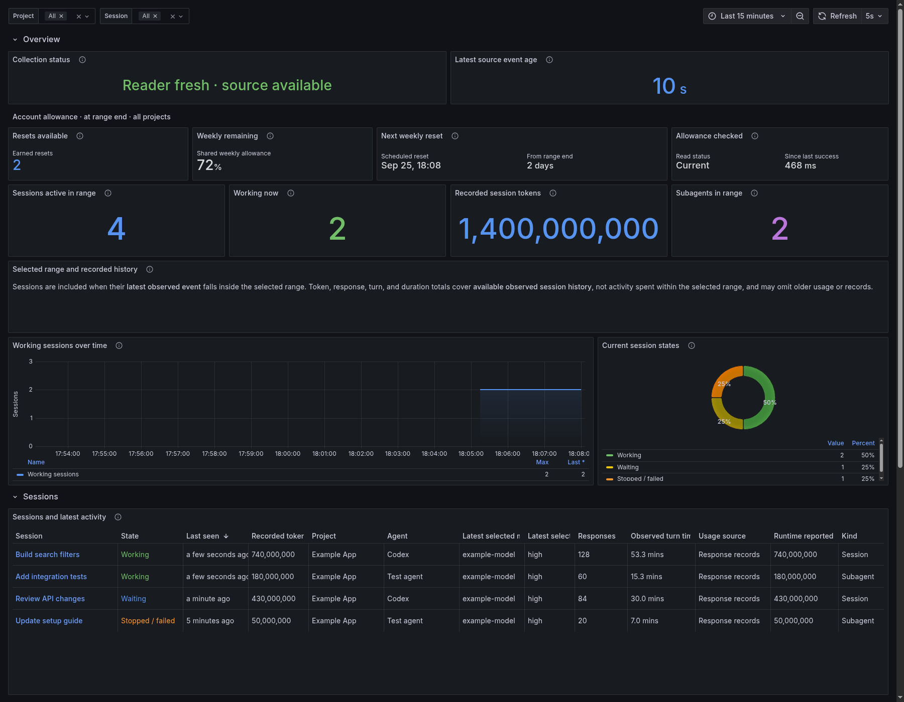

# All Sessions



*Example data. No personal sessions are shown.*

Use a compact session-centered view of recorded usage and activity.

## Import

Start the collector with [Quick Start](../getting-started.mdx). From the checkout root:

<!-- render-stable -->
```bash
export TRACEONAUT_DATA_DIR="$HOME/.local/share/traceonaut"
python3 scripts/render_codex_sessions_dashboard.py \
  --template examples/observability/codex-all-sessions.json \
  --snapshot-file "$TRACEONAUT_DATA_DIR/sessions.json" \
  --output "$TRACEONAUT_DATA_DIR/stable.json"
```

Import `stable.json` in Grafana and select your Prometheus datasource.

## Use the View

Select **Project**, **Session** and a time range. Choose **All** in the Session selector to include all matching sessions. Subagents appear as their own sessions.

[Reading the Values](reading-values.md) explains history totals, activity states and missing values. [Automatic Name Updates](../operations/automatic-name-updates.md) explains selector refreshes.
