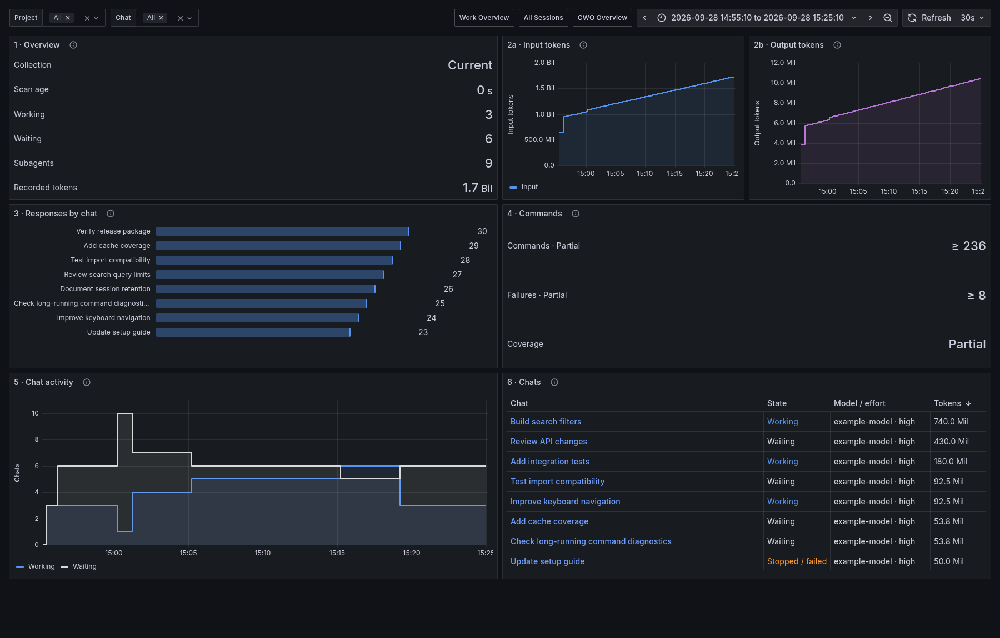

# Codex TUI · Beta



*Example data. No personal sessions are shown.*

A minimal Grafana version of the Codex CLI Usage screen in its Dashboard view.
In Codex, enter [`/usage`](https://developers.openai.com/codex/cli/slash-commands/#view-account-usage-with-usage)
to open Usage. This dashboard uses Traceonaut's existing session data in a compact,
two-column layout. Import it alongside your current dashboards; it has its own
UID and needs no additional collector.

## Import the Dashboard

With the session collector running, run this from the checkout root:

<!-- render-tui -->
```bash
export TRACEONAUT_DATA_DIR="$HOME/.local/share/traceonaut"
python3 scripts/render_codex_sessions_dashboard.py \
  --template examples/observability/codex-tui-beta.json \
  --snapshot-file "$TRACEONAUT_DATA_DIR/sessions.json" \
  --output "$TRACEONAUT_DATA_DIR/codex-tui-beta.json"
```

In Grafana, open **Dashboards → New → Import**, upload `codex-tui-beta.json`,
and select your existing Prometheus datasource. The title is **Codex TUI · Beta**.

For the full-width view shown above, use Grafana's kiosk mode. The normal view
keeps Grafana's navigation and the same six sections.

## Use the Dashboard

Choose a **Project**, **Chat** and time range. The default is 24 hours, with
a 30-second refresh.

| Section | Shows |
| --- | --- |
| 1 · Overview | Collection health, scan age, working/waiting chats, subagents and recorded tokens. |
| 2a · Input tokens | Recorded input token totals over time. |
| 2b · Output tokens | Recorded output token totals over time. |
| 3 · Responses by chat | The eight selected chats with the most recorded model responses. |
| 4 · Commands | Recorded commands and failures in the selected interval, with coverage. |
| 5 · Chat activity | Working and waiting chats over time. |
| 6 · Chats | Chat name, state, model/effort and recorded tokens. Click a name to open Work Overview. |

Token and response totals cover recorded session history for selected chats.
The time range selects activity; it does not turn those totals into interval
consumption. Totals can fall when older chats stop being exported or a
different set of chats is selected.
Commands marked **Partial** are lower bounds, shown as **≥**. Missing values
appear as **—**. Compact tokens use **K** (thousand), **Mil** (million) and
**Bil** (billion).

## Parts of the Codex Dashboard Not Included

This view omits plugin counts, skill counts, account lifetime statistics and
per-chat allowance percentages. See
[Reading the Values](reading-values.md) for shared metric meanings and
[Automatic Name Updates](../operations/automatic-name-updates.md) to refresh
session titles.
