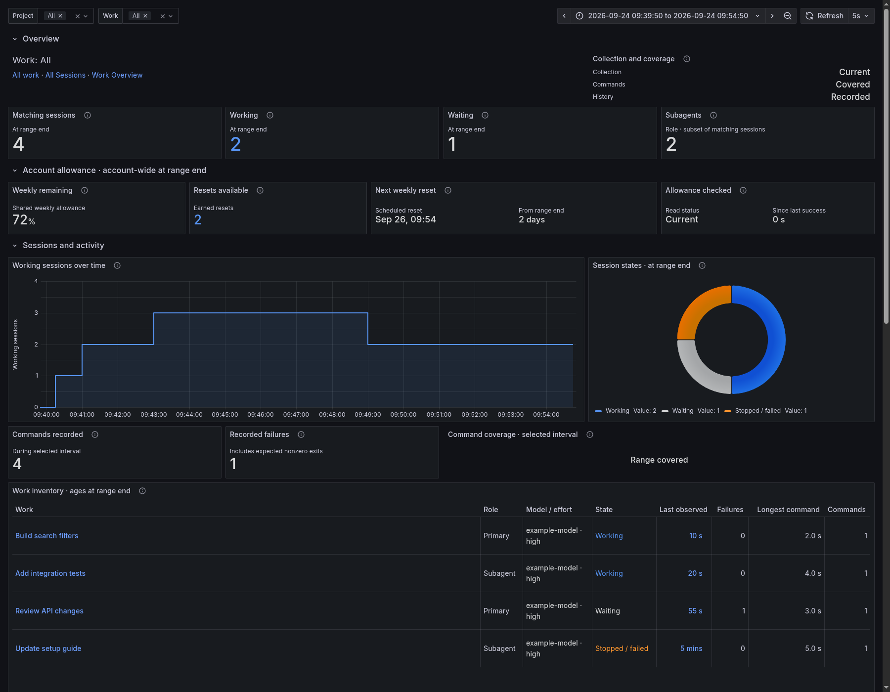

# Unified



*Example data. No personal sessions are shown.*

Unified brings session and agent inventory, activity, recorded usage and command outcomes into one dashboard.

## Import

Start the collector with [Quick Start](../getting-started.mdx). From the checkout root:

<!-- render-unified -->
```bash
export TRACEONAUT_DATA_DIR="$HOME/.local/share/traceonaut"
python3 scripts/render_codex_unified_dashboard.py \
  --template examples/observability/codex-unified-overview.json \
  --snapshot-file "$TRACEONAUT_DATA_DIR/sessions.json" \
  --output "$TRACEONAUT_DATA_DIR/unified.json"
```

Import `unified.json` in Grafana and select your Prometheus datasource.

## Use the Dashboard

Select Project, Work and a time range. Subagents are included in the session inventory. Choose a work title to focus it and **All work** to clear that filter.

[Reading the Values](reading-values.md) explains history totals, activity states and missing values. [Automatic Name Updates](../operations/automatic-name-updates.md) explains selector refreshes.
