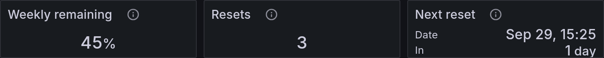

# Account Allowance

Account Allowance shows how much of your signed-in Codex account's weekly usage allowance remains. These are the three tiles at the right of the top status strip in [Work Overview](../dashboards/work-overview.md) and [All Sessions](../dashboards/all-sessions.md).



*Actual Grafana panels with synthetic values. These values apply to the whole account, regardless of the selected project or session.*

| Tile | What the example means |
| --- | --- |
| Weekly remaining: 45% | The account has 45% of its reported weekly usage allowance left. |
| Resets: 3 | Codex reports three earned usage resets available. Traceonaut displays this count; it does not redeem them. |
| Next reset: in 1 day | The reported weekly reset is due in one day. The tile also shows its date and time. |

This is account allowance, separate from the token totals recorded for individual sessions. The optional account reader fetches these values using your existing Codex login. The session collector exposes them on its existing Prometheus endpoint. History begins when the reader is enabled; read freshness appears in Diagnostics.

## Start the Reader

From the checkout root, choose your profile and absolute Codex binary path:

```bash
TRACEONAUT_DATA_DIR="$HOME/.local/share/traceonaut"
TRACEONAUT_SOURCE_HOME="$HOME/.codex"
TRACEONAUT_CODEX_BINARY="/absolute/path/to/codex"
install -d -m 700 "$TRACEONAUT_DATA_DIR/account-state"
python3 scripts/collect_codex_account.py \
  --codex-bin "$TRACEONAUT_CODEX_BINARY" \
  --codex-home "$TRACEONAUT_SOURCE_HOME" \
  --snapshot-file "$TRACEONAUT_DATA_DIR/account-state/allowance.json"
```

Add `--once` for a single read. For continuous use, polling runs about once per minute.

Restart the session collector with:

```bash
--account-snapshot-file "$TRACEONAUT_DATA_DIR/account-state/allowance.json"
```

Use the same code version for both collectors and keep the account snapshot separate from session state. The [service guide](../operations/run-as-a-service.md) applies to this reader too; it needs upstream network access.

## Read the Strip

A successful read is current for 150 seconds. A failed read clears numeric values; a stopped reader becomes stale. **Awaiting update** means a scheduled reset has passed and a fresh account response is needed.

Values are measured at the selected range end and apply to the signed-in account. They are allowance percentages and credits, not per-session token budgets. Switching logins changes the source of subsequent samples.

The reader requests account limits without starting model work or redeeming resets. Its protected snapshot contains numeric values and timestamps. Account identities and credentials stay out of the metrics.
